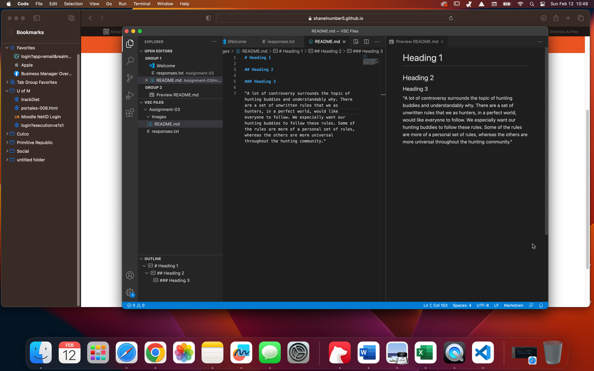

# Heading 1

## Heading 2

### Heading 3

"A lot of controversy surrounds the topic of hunting buddies and understandably why. There are a set of unwritten rules that we as hunters, in a perfect world, would like everyone to follow. We especially want our hunting buddies to follow these rules. Some of the rules are more of a personal set of rules, whereas the others are more universal throughout the hunting community."

# Three things learned

## 1. How to use basic text in VSC
## 2. How to add urls in VSC
## 3. How to add Screenshots or images in VSC

[Click Here](https://www.amazon.com/Rules-Finding-Good-Hunting-Partner-ebook/dp/B07P7ZXMSC/ref=sr_1_1?crid=1NZ77H0FFDGPP&keywords=ten+rules+for+finding+a+good+hunting+partner&qid=1676225075&sprefix=ten+rules+for+finding+a+good+hunting+partner%2Caps%2C170&sr=8-1)

[My File](responses.txt)

