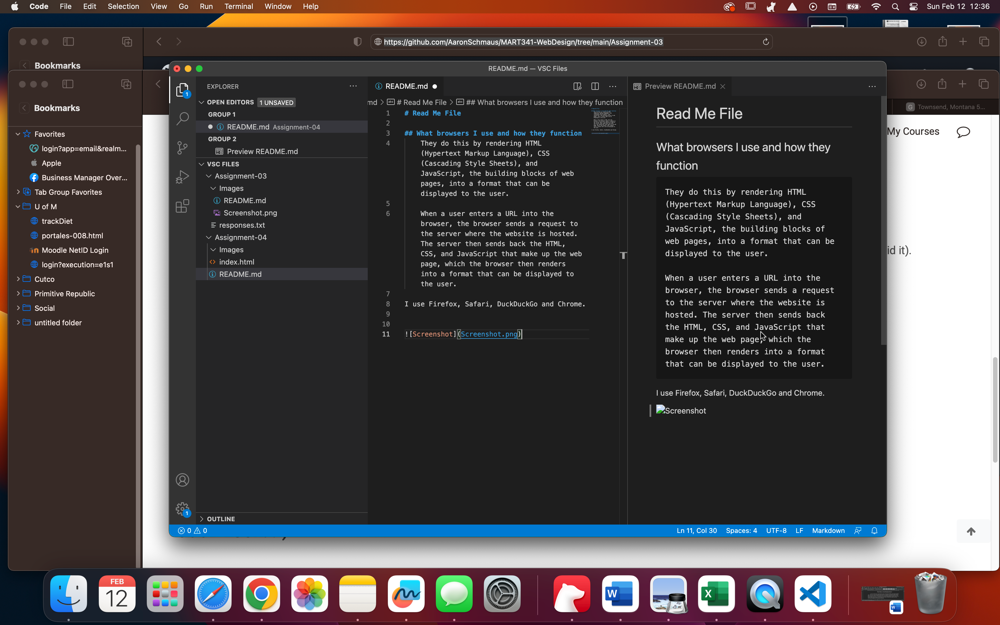

# Read Me File

## What browsers I use and how they function
    They do this by rendering HTML (Hypertext Markup Language), CSS (Cascading Style Sheets), and JavaScript, the building blocks of web pages, into a format that can be displayed to the user.

    When a user enters a URL into the browser, the browser sends a request to the server where the website is hosted. The server then sends back the HTML, CSS, and JavaScript that make up the web page, which the browser then renders into a format that can be displayed to the user.

I use Firefox, Safari, DuckDuckGo and Chrome.

