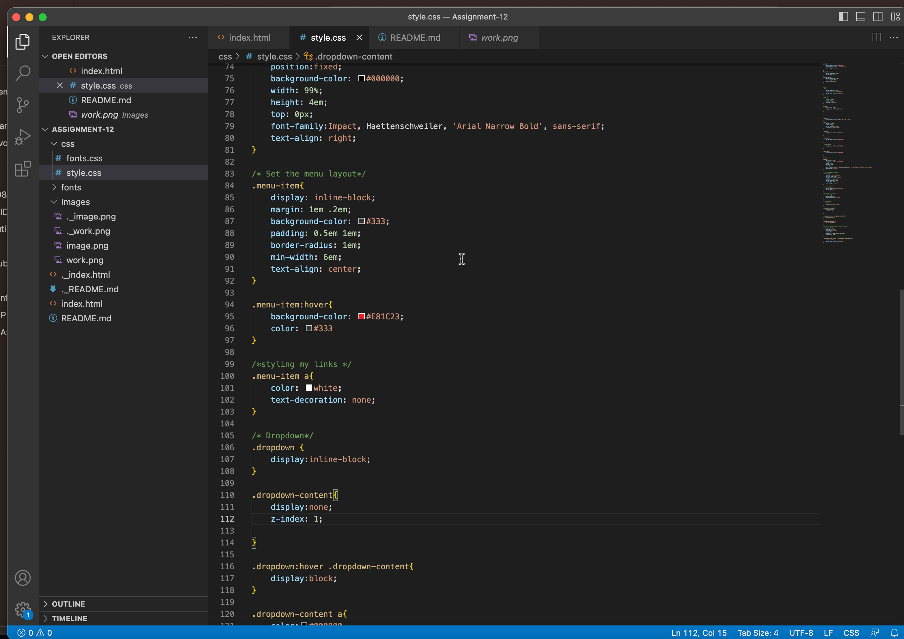

# Read Me File

## Forms
What is the difference between padding, margin, and borders?

Padding, margin, and borders are all fundamental properties of CSS box model, and they are used to control the space and layout of elements on a webpage.

Padding is the space between the content and the element's border. It can be defined using the CSS padding property and is used to create space around an element's content. For example, if you want to create space between the text and the border of a box, you would add padding.

Margin is the space between the element's border and the surrounding elements or the edge of the containing element. It can be defined using the CSS margin property and is used to create space around an element. For example, if you want to create space between two elements, you would add margin to one of the elements.

Borders are the lines that surround the content and padding of an element. Borders can be defined using the CSS border property and are used to add visual separation between elements or to emphasize an element. Borders can be solid, dashed, dotted, or any other style that can be defined in CSS.

how did this week's assignment go? What challenges did you face, and how did you overcome them?

This week's assignment is much more understandable in my opinion. I have a little better understanding of class selectors.  I did run into a few problems with the ".dropdown-content" id with it not wanting to accept my ":" and causing errors but I was able to work around that and change the style a bit.  

