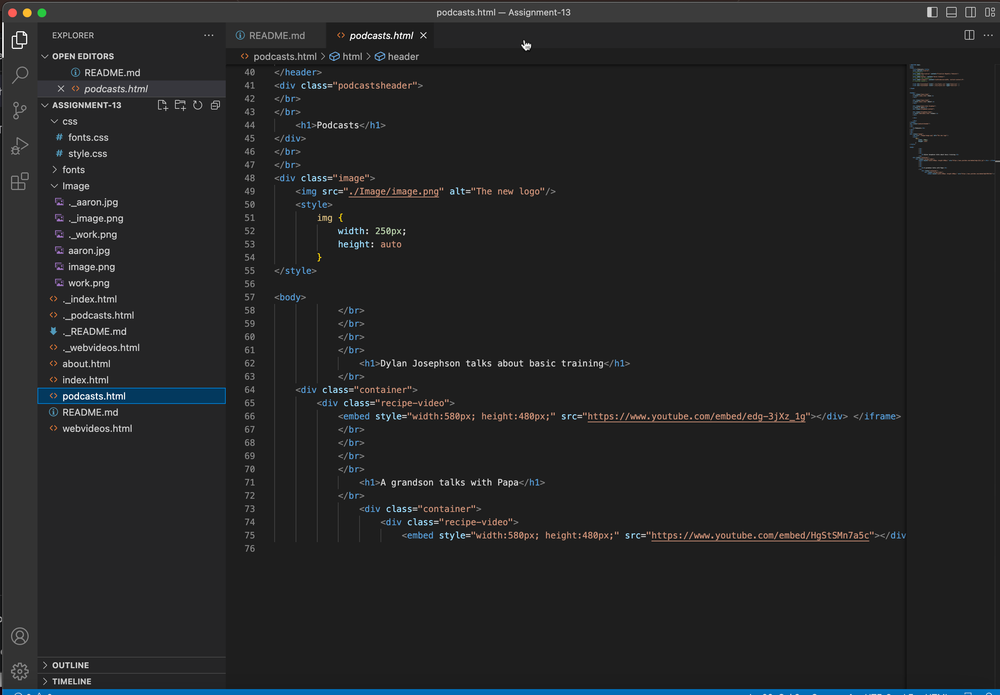

# Read Me File

## Forms
What is the goal of your website? (Think in terms of your user -- why might they visit your site?)

The goal of my site is to highlight my podcast and some of the videos that I have created. Hopefully, the user would find that the site is clean, easy to navigate, and would find the content entertaining. 

Why is responsive web design important?

Responsive web design is important because it allows a website to adapt and adjust to the screen size and device type that a user is viewing it on. With the increasing variety of devices that people use to access the internet, it has become essential for websites to be designed to accommodate this variety.

This would create a better user experience, SEO and more cost effective since you don't have to have seperate websites for the different devices. 

