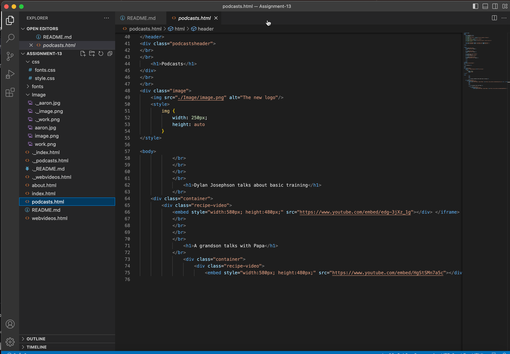

# Read Me File

## Forms
What is the goal of your website? (Think in terms of your user -- why might they visit your site?)

The goal of my site is to highlight my podcast and some of the videos that I have created. Hopefully, the user would find that the site is clean, easy to navigate, and would find the content entertaining. 

This class was very difficult for me.  I am clearly not a coder or web developer.  Not to say that I cannot become better at it but I feel that video is probably more my forte. That being said, it was a very informative class and definately challenged my abilities. Thank you. 

